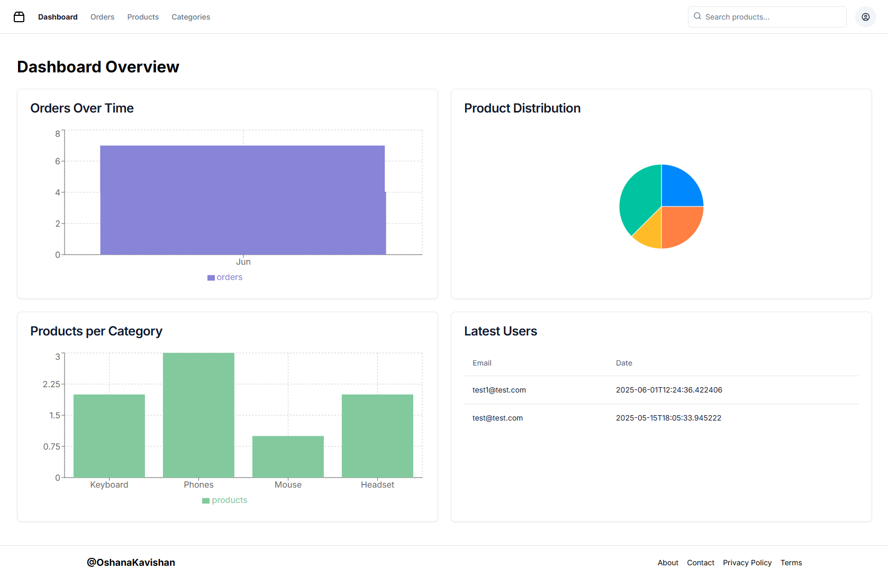
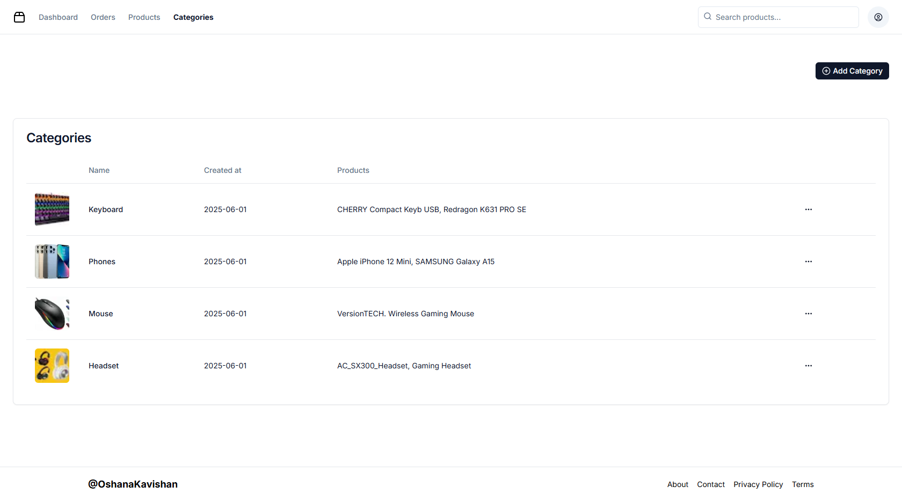
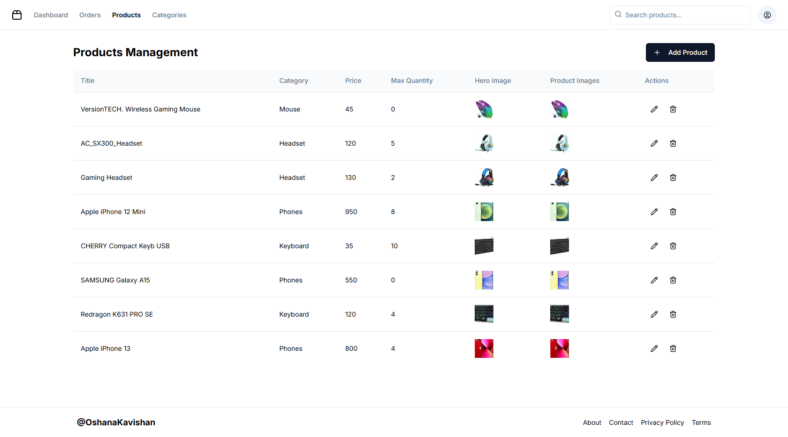
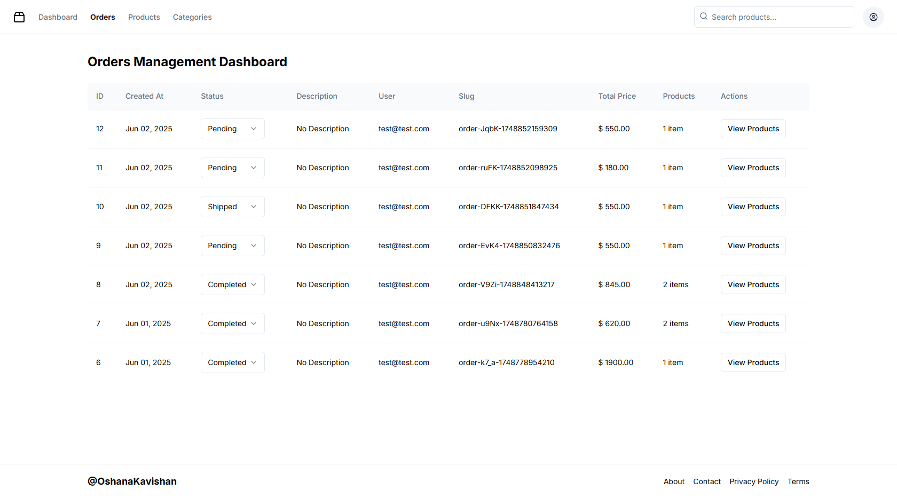

# 📱 Fullstack Mobile & Web E-Commerce App with React Native, Supabase & Next.js

Welcome to my **Fullstack Mobile & Web E-Commerce App** project! 🚀

This app includes a sleek mobile shopping experience built with **React Native** and **Supabase**, plus a powerful admin dashboard built using **Next.js** to manage products and orders easily.

---

## 📸 Preview Screenshots

Take a look at some key sections of the project:

### 🧑‍💼 Admin Panel (Next.js)

- **Dashboard**
  
  

- **Categories Management**
  
  

- **Products Management**
  
  

- **Orders Management**
  
  
  
---

## 🔧 Prerequisites

Before you begin, make sure you have:

- Node.js (v14 or newer) 🔥  
- npm (comes with Node.js) 📦  
- Git 🐙  

---

## 🚀 Getting Started

Follow these steps to set up the project locally:

### 1️⃣ Clone the Repository

```bash
git clone https://github.com/OshanaKavishan/gadgets-shop-admin.git
cd gadgets-shop-admin
```
### 2️⃣ Install Dependencies

```bash
npm install
```
### 3️⃣ Configure Environment Variables
Rename .env.example to .env.local and update with your own keys and URLs:
```bash
mv .env.example .env.local
```
🔑 Add your Supabase credentials and any other required environment variables.

### 4️⃣ Start the Development Server
```bash
npm run dev
```
Open your browser at 👉 http://localhost:3000 to see the admin panel.

## 🗂️ Project Structure
- /mobile — React Native mobile app

- /admin — Next.js admin dashboard

- /backend — Supabase backend and database

## 🤝 Contributions
Contributions, issues, and feature requests are welcome! Feel free to connect. ✨

## 🎥 Watch the Full Course Video
If you want to deepen your understanding or explore a step-by-step guide related to this project, check out this helpful YouTube playlist:

👉 [Fullstack Gadgets App: React Native Expo & Next.js Admin](https://youtu.be/26opRFPU0a8)

